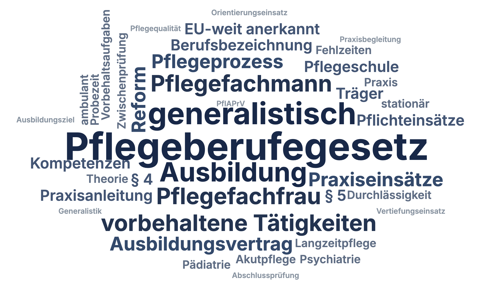

# TermCluster

[](https://revealjs.com) [](LICENSE)

Interactive word clouds for [reveal.js](https://revealjs.com). Author a topic's key terms as a simple list — a leading number sets each word's size — and TermCluster renders a dense, tidy cloud. On **hover** (desktop) or **tap** (touch / smartboard) a word grows and comes into focus while the rest steps back. Standalone (ships its own CSS), colours and shapes are easy to theme, and it works fully offline.

**[Live demo](https://florianloyns.github.io/reveal.js-termcluster/demo.html)**

[](https://florianloyns.github.io/reveal.js-termcluster/demo.html)

## Why — the advance organizer

A word cloud is a great **advance organizer** (Ausubel): before you dive into a topic, you show its landscape of key terms at a glance. That activates prior knowledge ("which of these do you already know?"), gives an overview of what's coming, and — tapped again at the end of the lesson — doubles as a recap to check completeness. The size of a word is a deliberate teaching signal: the biggest words are your anchors. Because you set the sizes yourself (or let them be assigned automatically), the cloud reflects *your* emphasis, not a word-frequency count.

## Installation

Copy the `termcluster` folder (including its `vendor/` subfolder) into your reveal.js `plugin/` folder — or install from npm.

```console
npm install reveal.js-termcluster
```

## Setup

TermCluster uses the bundled [wordcloud2.js](https://github.com/timdream/wordcloud2.js) for the packing, so **load `vendor/wordcloud2.js` before the plugin**.

**Regular**

```html
<script src="dist/reveal.js"></script>
<script src="plugin/termcluster/vendor/wordcloud2.js"></script>
<script src="plugin/termcluster/termcluster.js"></script>
<script>
  Reveal.initialize({ plugins: [ RevealTermCluster ] });
</script>
```

**As a module**

```html
<script src="plugin/termcluster/vendor/wordcloud2.js"></script>
<script type="module">
  import Reveal from './dist/reveal.esm.js';
  import RevealTermCluster from './plugin/termcluster/termcluster.esm.js';
  Reveal.initialize({ plugins: [ RevealTermCluster ] });
</script>
```

## Usage

Write your words as a list inside a `<div class="termcluster">` — one per line, a **number in front sets the size**. Words without a number get a pleasant automatic size, so you never *have* to weight them.

```html
<div class="termcluster">
  14 Photosynthesis
  9 Chlorophyll
  7 Sunlight
  6 Oxygen
  Glucose
</div>
```

Big number = big word. Tap a word to bring it into focus; tap again to release. Feedback is by size and colour only, so nothing shifts on the slide.

Prefer elements? `<span data-weight="9">Chlorophyll</span>` works too.

## Per-slide options

Override the look on any single cloud with `data-*` attributes:

```html
<div class="termcluster" data-shape="cardioid" data-colors="green" data-angles="0"> … </div>
```

| Attribute | Values | Description |
|---|---|---|
| `data-shape` | `circle` `cardioid` `star` `diamond` `triangle` `pentagon` `square` | Outline the cloud fills |
| `data-ellipticity` | `0`–`1` | Flatness of the shape (lower = wider) |
| `data-grid` | number | Spacing between words (larger = airier) |
| `data-size` | number | Overall size factor |
| `data-angles` | `0` `90` `any` | Rotation: none, upright/vertical, or free |
| `data-rotate` | `0`–`1` | Share of rotated words |
| `data-colors` | `marine` `green` `warm` `dark` | Colour scheme (`dark` = light text for dark slides) |

## Configuration

Global defaults (optional) — any per-slide `data-*` still wins:

```js
Reveal.initialize({
  termcluster: {
    shape: 'circle',
    ellipticity: 0.65,
    gridSize: 12,
    weightFactor: 7,
    angles: '90',
    colors: 'marine'
  },
  plugins: [ RevealTermCluster ]
});
```

## Credits

Packing by [wordcloud2.js](https://github.com/timdream/wordcloud2.js) © Tim Guan-tin Chien (MIT), bundled in `plugin/termcluster/vendor/`. Built for [reveal.js](https://revealjs.com) by Hakim El Hattab.

## Like it?

Star the repo.

## License

MIT — see [LICENSE](LICENSE).
